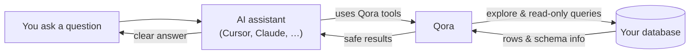

# Qora

**Talk to your data. Get clear answers, insights, and analysis.**

Qora lets AI assistants like Cursor and Claude safely explore your database and answer questions about your data in plain English.

Ask things like:

> "How many orders did we receive last month?"

> "Which products are selling the most?"

> "Show me the tables related to customers."

Qora looks up the answers directly from your database and gives them back to your AI assistant.

**Qora is read-only by design.** It can inspect and query your data, but it cannot insert, update, or delete anything.

## How it works

1. You ask something.
2. Your AI assistant calls Qora.
3. Qora looks up schemas/tables or runs a read-only query.
4. Results go back to the assistant, which answers you.

## What Qora does

Qora gives your AI assistant safe, read-only access to the database.

- **Discover schemas and tables** - so the assistant knows what’s available
- **Describe table structure** - columns, types, and nullability
- **Run read-only SQL** - the assistant writes the query; Qora validates and executes it
- **Return results safely** - capped row counts, no writes or schema changes

## Read-only by design

1. Only read-style queries are allowed
2. Connect with a read-only database user
3. Result size is capped
4. HTTP access can be limited to specific hosts

## Tools

| Tool             | What it does                     |
| ---------------- | -------------------------------- |
| `list_schemas`   | See the main areas of your data  |
| `list_tables`    | See what tables exist            |
| `describe_table` | Understand what's inside a table |
| `run_query`      | Run a validated read-only SELECT |

## Docs

- **[Setup](./SETUP.md)** - install, env, MCP clients, HTTP, Docker
- **[Contributing](./CONTRIBUTING.md)** - Dev Container, scripts, PR checklist
